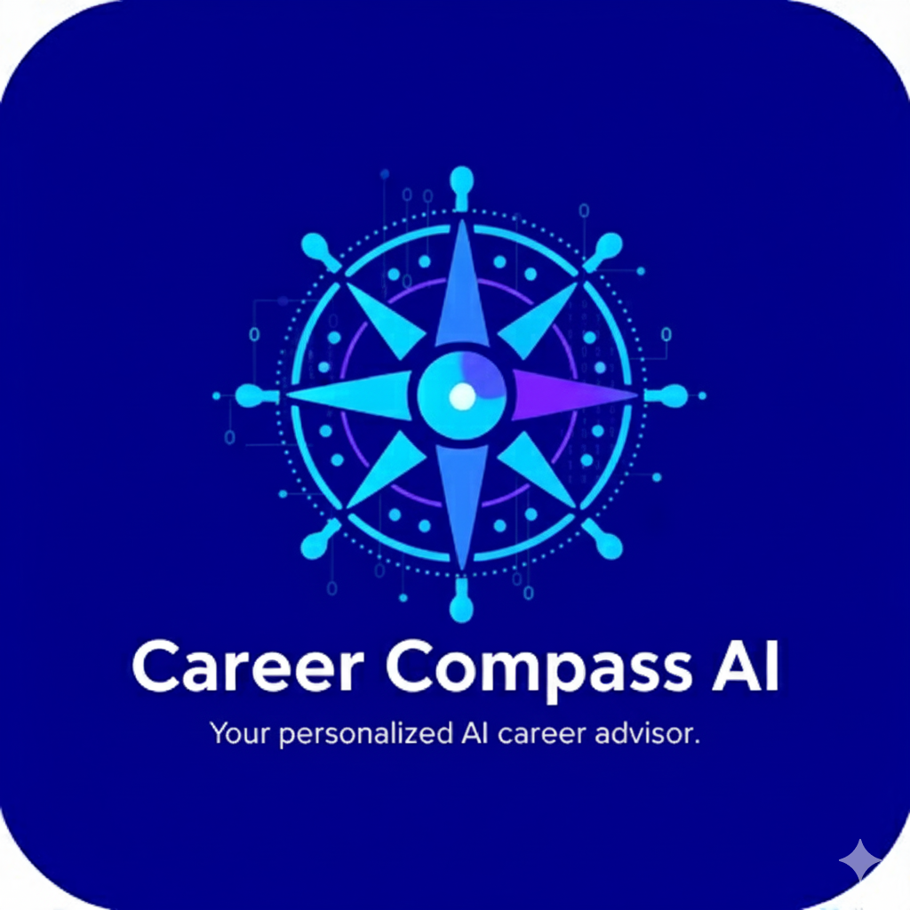
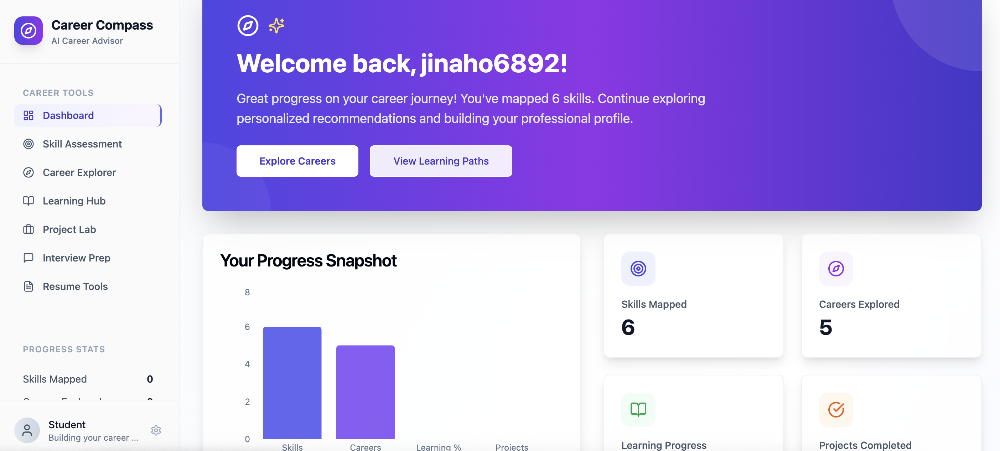
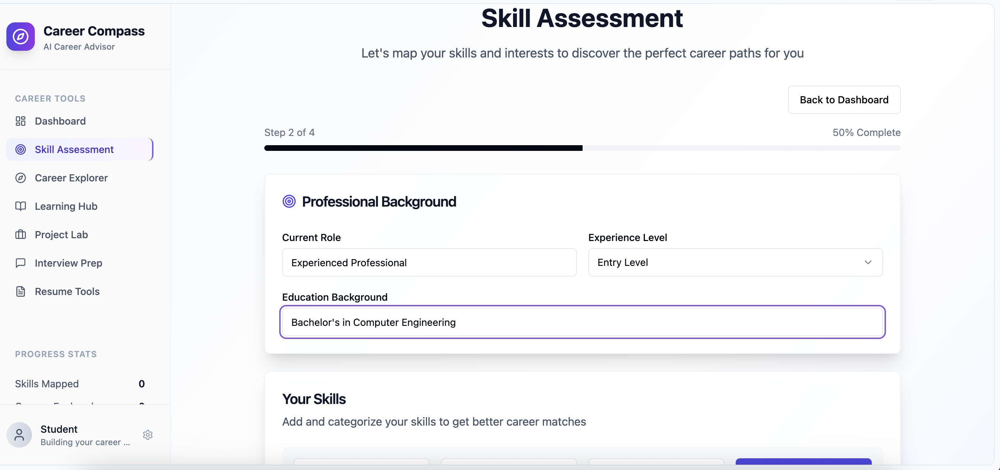
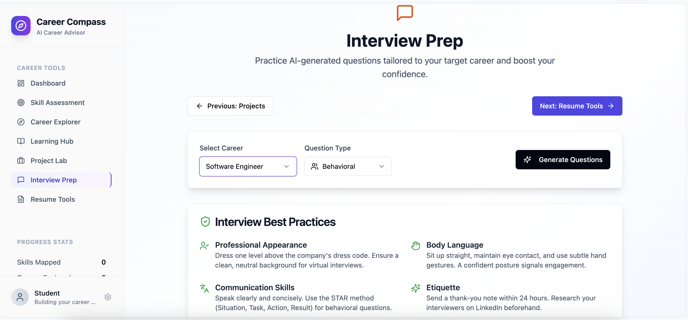

#  Career Compass AI

[](LICENSE) [](https://github.com/Bhavana0212/career-compass-ai/stargazers) [](https://app--career-compass-ai-a0b8bb57.base44.app)

**Team ON9 Developers**  
**Team Lead:** Bhavana Shah  
**Team Members:** Sameer Ahmed, S. Baskar  

> **A Personalized AI-powered Career and Skills Advisor** helping students and professionals discover, prepare for, and achieve career goals in a structured way.

---

## 🌟 Overview

Career Compass AI is an **innovative AI-driven career advisory platform** designed to:

- Map user skills  
- Recommend suitable career paths  
- Guide users from learning to interview readiness  

With AI-powered insights, users can confidently navigate the competitive job market.

---

## 🎯 Problem Statement

Students and professionals often struggle with:

- Choosing the right career path based on interests and strengths  
- Learning necessary skills in a structured manner  
- Preparing effectively for technical and behavioral interviews  

**Career Compass AI provides a full end-to-end personalized solution.**

---

## 🚀 Key Features

| Feature | Description |
|---------|-------------|
| **Career Identification** | Suggests career paths based on skills and interests |
| **Skill Roadmap & Learning Resources** | Personalized learning paths with courses, skill trackers, and certifications |
| **Progress Tracking** | Monitors milestones and learning progress |
| **Interview Preparation** | Practice questions, mock tests, and behavioral interview tips |
| **Resume Builder** | AI-powered resume customization tailored to career goals |
| **Project Lab** | Hands-on project recommendations for skill application |

---

## 🎬 Demo / Prototype

  
*Animated demo of Career Compass AI workflow.*

[View Live Prototype](https://app--career-compass-ai-a0b8bb57.base44.app)

---

## 🖼 Screenshots

  
*Dashboard showing user summary and recommended next steps.*

  
*Skill assessment and personalized learning path.*

  
*Interview preparation interface.*

> Replace placeholders with real screenshots/GIFs for maximum hackathon impact.

---

## 📁 Folder Structure

```

career-compass-ai/
├── pages/
│   ├── index.js
│   ├── dashboard.js
│   ├── skill-assessment.js
│   ├── career-explorer.js
│   ├── learning-hub.js
│   ├── project-lab.js
│   ├── interview-prep.js
│   └── resume-tools.js
├── components/
│   ├── dashboard/
│   ├── skills/
│   ├── career/
│   ├── learning/
│   ├── projects/
│   └── interview/
├── entities/
│   ├── UserProfile.js
│   ├── CareerPath.js
│   ├── LearningPath.js
│   ├── Project.js
│   └── InterviewPrep.js
├── layout.js
├── package.json
└── assets/
├── logo.png
├── dashboard.png
├── skills.png
├── interview\.png
└── demo.gif

````

---

## 🛠 Tech Stack

- **Frontend:** Next.js / React  
- **Backend:** Node.js (optional)  
- **AI Integration:** Base44 / Custom AI models  
- **Version Control:** GitHub  
- **Deployment:** Vercel / Netlify  

---

## 📌 How to Run Locally

1. Clone the repository:  
```bash
git clone https://github.com/Bhavana0212/career-compass-ai.git
cd career-compass-ai
````

2. Install dependencies:

```bash
npm install
```

3. Run the project:

```bash
npm run dev
```

4. Open in browser:

```
http://localhost:3000
```

---

## 🌐 Future Enhancements

* Advanced **interview modules**: body language, communication, etiquette
* **Company-specific opportunities** based on skills
* Real-time analytics for **learning progress tracking**
* Cloud-host AI models for **real-time skill assessment and recommendations**

---

## 🏆 Why Career Compass AI Wins

* **Innovative:** AI-driven personalized career guidance
* **Impactful:** Helps students/professionals make informed career decisions
* **Feasible:** Modular and scalable architecture
* **Scalable:** Easily integrates more careers, skills, and AI recommendations

---

## 📂 Assets Folder

* `assets/logo.png` → Project logo
* `assets/dashboard.png` → Dashboard screenshot
* `assets/skills.png` → Skill Assessment screenshot
* `assets/interview.png` → Interview Prep screenshot
* `assets/demo.gif` → Demo workflow GIF


---

## 📜 License

This project is open-source under the **MIT License**.

